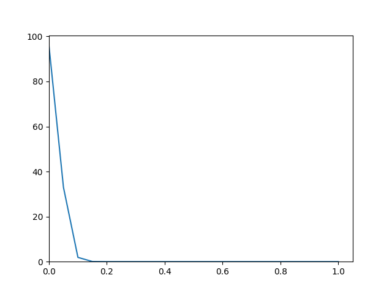
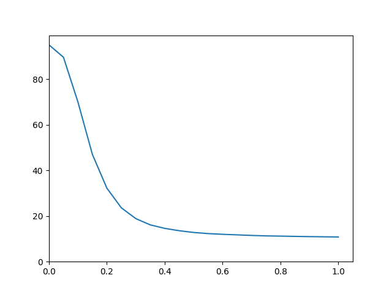
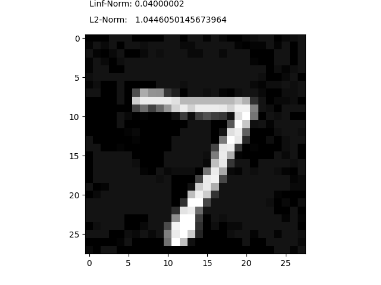
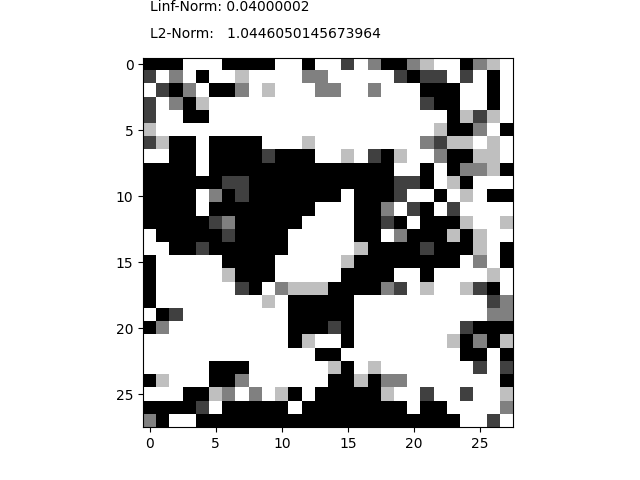
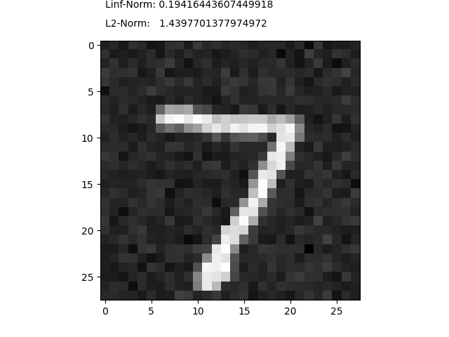

# Adversial Attacks on Neural Networks

### 1) FGSM - Fast Gradient Sign Method (WhiteBox Attack)

Method: https://arxiv.org/pdf/1412.6572.pdf

Outcome:
Original | Adversial Image
:--------:|:----------------|
 | 

Using different epsilon values and comparing their effectiveness
On normally trained NN | On retrained NN (with adversial examples)
:-----:|:----|
 | 

Retraining the model with the 

### 2) PGD - Projected Gradient Descent (WhiteBox Attack)

Method: https://arxiv.org/pdf/1706.06083.pdf

Original | Adversial Image | Adversial Pattern
:-------:|:---------------:|:-----------------|
 |  | 

L-inf: 0.04
L2: 1.0446

### 3) ZOO - Zeroth Order Optimisation (BlackBox Attack)

Method: https://openreview.net/pdf?id=rJlk6iRqKX

Original | Adversial Images
:-----------:|:-------------|
 |  

Quality of the Black Box Adversial Images varies depending on the random initial direction-gradient.

